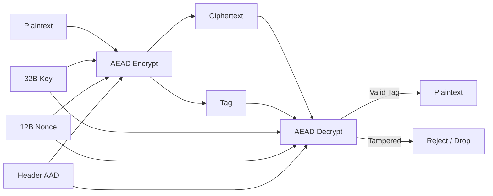

# Applied Cryptography

[](https://colab.research.google.com/github/Rijzzz/Applied-Cryptography/blob/main/Applied-Cryptography.ipynb)
[](./LICENSE)

A simple Python project showing how to encrypt data with AES_GCM and ChaCha20_Poly1305.

### How It Works



### What It Does
* Encrypts and decrypts secret messages and files
* Protects packet headers so nobody can tamper with them
* Blocks replay attacks using sequence numbers
* Runs security tests and speed benchmarks
* Includes a command-line tool (CLI) for text and file encryption

### Performance
Real throughput measured with Python 3.13 (200 rounds per size):

| Algorithm | 64 Bytes | 1024 Bytes | 65536 Bytes |
| :--- | :--- | :--- | :--- |
| **AES_GCM** | 11.7 MB/s | 180.9 MB/s | 897.9 MB/s |
| **ChaCha20_Poly1305** | 5.1 MB/s | 140.8 MB/s | 558.1 MB/s |

You can reproduce these results on your machine by running:
```bash
python Applied-Cryptography.py --benchmark
```

### Quick Start
Install the library:
```bash
pip install cryptography
```

Run all tests and benchmarks:
```bash
python Applied-Cryptography.py
```

Encrypt a message from the terminal:
```bash
python Applied-Cryptography.py --encrypt-text "My Secret" --algo AES_GCM
```

Encrypt and decrypt a file:
```bash
python Applied-Cryptography.py --encrypt-file document.pdf document.enc
python Applied-Cryptography.py --decrypt-file document.enc restored.pdf --key <HEX_KEY>
```

### My Thoughts
I built this project for learning, testing, and daily CLI file encryption. If you plan to use it in a big production service, here are a few things I think you should keep in mind:
* **Large Files:** Right now, my code reads the whole file into memory at once. For huge files (like multi gigabyte videos or backups), encrypt the file in small chunks so your computer does not run out of RAM.
* **Key Storage:** Do not store keys in plain text. Keep them in a secret manager (like AWS Secrets Manager), or create them from passwords using Argon2 or PBKDF2.
* **Long Running Sessions:** My replay check keeps old message numbers in memory. If your app runs for days or weeks, switch to a sliding window so memory stays small and fixed.
* **Key Rotation:** If you encrypt millions of packets, make sure to switch to a new key regularly.

You can also open Applied-Cryptography.ipynb in Jupyter or Google Colab.
